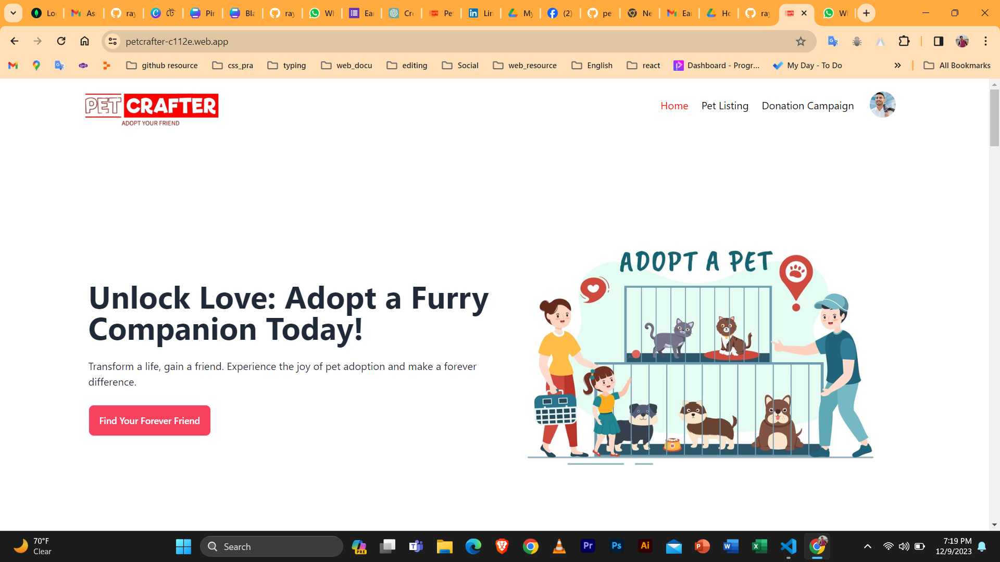

# Pet Crafter || Pet Adoption Site



*Live Link:* [Pet Crafter Live](https://petcrafter-c112e.web.app/)

## Project Overview

Pet Crafter is a dynamic Full-Stack project developed in a short span of 4 days. It aims to revolutionize the pet adoption experience by seamlessly connecting pet seekers with their future companions.

### Features

#### For Users:
- **Adoption Requests:** Submit adoption requests for pets.
- **Donation Campaigns:** Contribute to meaningful donation campaigns.
- **Secure Payments:** Make payments using a card for donations.

#### For Admins:
- **User Management:** View and manage all user profiles.
- **Adoption Oversight:** Monitor and oversee pet adoption requests.
- **Campaign Tracking:** Track and manage ongoing donation campaigns.

### Usage Technology

#### Front-End:
- **React.js:** Dynamic and responsive user interfaces.
- **Tailwind CSS & DaisyUI:** Visually appealing and highly customizable designs.
- **React-Select:** Intuitive dropdowns.
- **Lottie-React:** Engaging animations.

#### Back-End:
- **Express.js:** Robust server-side development.
- **MongoDB:** NoSQL database for efficient data management.
- **JWT & Formik:** Secure authentication and seamless form handling.
- **Tanstack Query & Axios:** Optimized data fetching and manipulation.

#### Additional Integrations:
- **Swipper.js:** Delightful image-swiping experience.
- **Stripe for Payment:** Secure and reliable card payments.
- **Cloudinary API & ImgBB:** Enhanced image management and storage.
- **Unique Icons:** Thoughtfully designed icons.

### Installation

1. Clone the repository:
   ```bash
   git clone https://github.com/rayhan360/petCrafter-client.git

   Install dependencies:
   cd pet-crafter
    npm install
